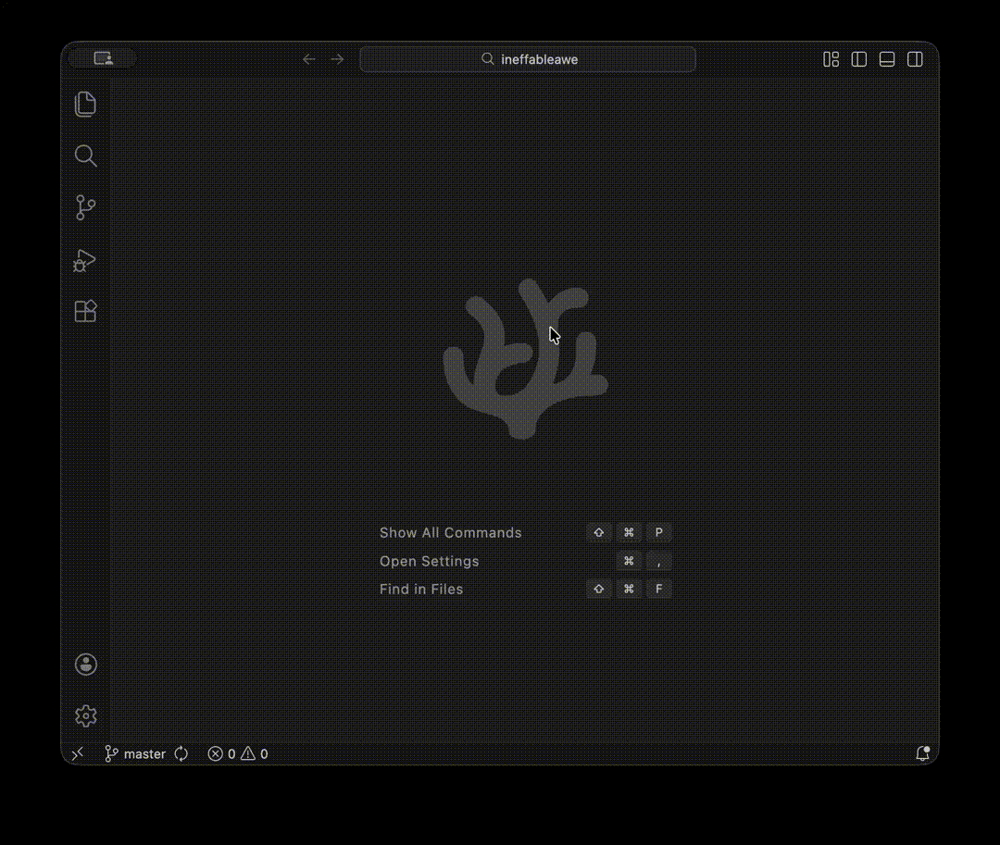

# Jekyll Post Creator for VS Code

A Visual Studio Code extension that simplifies creating new Jekyll blog posts with proper frontmatter formatting and system-accurate timestamps using a dedicated panel.



## Features

- Create new Jekyll posts via an **interactive Webview panel**.
- Enter post title, categories, tags, and select layout easily within the panel.
- **Add custom front matter options** (key-value pairs) directly in the UI.
- **Responsive design** that adapts to panel size and uses **VS Code theme colors**.
- Webview UI is built with separate **HTML, CSS, and JavaScript** files for easier maintenance.
- Automatically formats the filename using the date and post title: `YYYY-MM-DD-title-slug.md`.
- Generates frontmatter with:
  - Title (from your input)
  - Layout (post, page, or custom)
  - Categories (in array format: `["category1","category2"]`)
  - Tags (in array format: `["tag1","tag2"]`)
  - Date (using local system time with timezone offset)
  - Any **custom options** you added.
- Automatically finds or creates the `_posts` directory.
- Opens the new post file for immediate editing after creation.

## Installation

### Manual Installation from .vsix file

1. Download the `.vsix` file from the [Releases](https://github.com/nativvstudios/jekyll-post-creator/releases) page
2. In VS Code, go to Extensions view (`Ctrl+Shift+X`)
3. Click the `...` menu in the top-right of the Extensions view
4. Select **"Install from VSIX..."** and choose the downloaded file

### Building From Source

1. Clone the repository:
   ```bash
   git clone https://github.com/nativvstudios/jekyll-post-creator.git
   cd jekyll-post-creator
   ```

2. Install dependencies:
   ```bash
   npm install
   ```

3. Package the extension:
   ```bash
   npm run package
   ```

4. The packaged extension (`.vsix` file) will be created in the project root

## How to Use

### Command Palette

1. Press `Ctrl+Shift+P` (or `Cmd+Shift+P` on macOS) to open the command palette.
2. Type `Jekyll: Create New Post` or `Jekyll: Show Creator Window` and select either command.
3. A **"Jekyll Post Creator" panel** will open in your editor pane.
4. Fill in the details in the panel:
   - **Title:** The main title of your post.
   - **Categories:** Space-separated words (e.g., `tech tutorial`).
   - **Tags:** Space-separated words (e.g., `vscode extension javascript`).
   - **Layout:** Select from the dropdown (`post`, `page`, `custom`).
   - **Additional Options:** Click the "+ Add Option" button to add custom front matter fields (e.g., key: `comments`, value: `true`). Use the "-" button to remove options.
5. Click the "Create Post" button.

### ~~Context Menu~~

*(Note: The context menu entry currently triggers the command palette flow, which opens the panel.)*

## Output Example

For a post titled "My First Jekyll Post" with categories "life recap", tags "jekyll markdown", and a custom option `published: true`, the extension creates:

Filename: `2025-04-05-my-first-jekyll-post.md` (date will match current system date)

Content:
```markdown
---
layout: post
title: "My First Jekyll Post"
date: 2025-04-05 15:30:45 -0400
categories: ["life","recap"]
tags: ["jekyll","markdown"]
published: true
---

```

## Directory Handling

The extension will:
1. Look for an existing `_posts` directory in your workspace
2. If not found, it will either:
   - Create the directory for you
   - Let you select a different location
   - Cancel the operation

## Requirements

- Visual Studio Code 1.74.0 or higher

